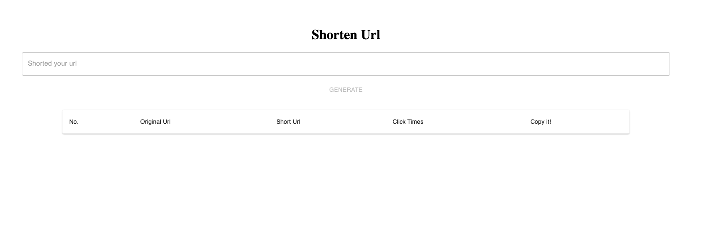

# Short Url Frontend
A website for user to generate short url.
Server side please check [here](https://github.com/chitsutote/short-url-server)
# Environment
- node: 16.4.2
- yarn: 1.22.19

# Installation
run command `yarn` to install dependencies

# Prerequisite
You need to have the server([https://github.com/chitsutote/short-url-server](https://github.com/chitsutote/short-url-server)) up 
# How to run
1. run `yarn dev`
2. Open browser, type `http://127.0.0.1:5173`, you'll be able to see log in page
3. register an account in `http://127.0.0.1:5173/signup` if you don't have one.
4. after log in, you'll be able to see this page

5. type the url you want to shorted, you'll get the shortened url in the input or on the list below.

# File Structure
```
src
 ┣ Pages
 ┃ ┣ Home
 ┃ ┣ LoginPage.tsx
 ┃ ┗ SignUpPage.tsx
 ┣ api
 ┣ components # shared components
 ┣ config
 ┣ types # self-defined data types
 ┣ utils # util helper function
 ┣ App.tsx
 ┣ index.css
 ┣ main.tsx
 ┗ vite-env.d.ts
 ```